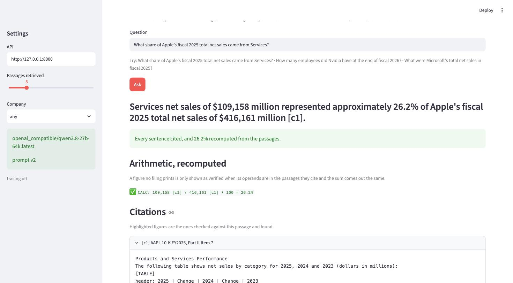
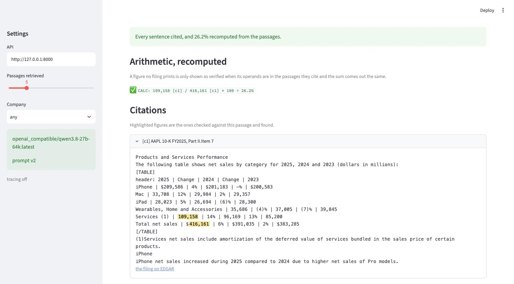
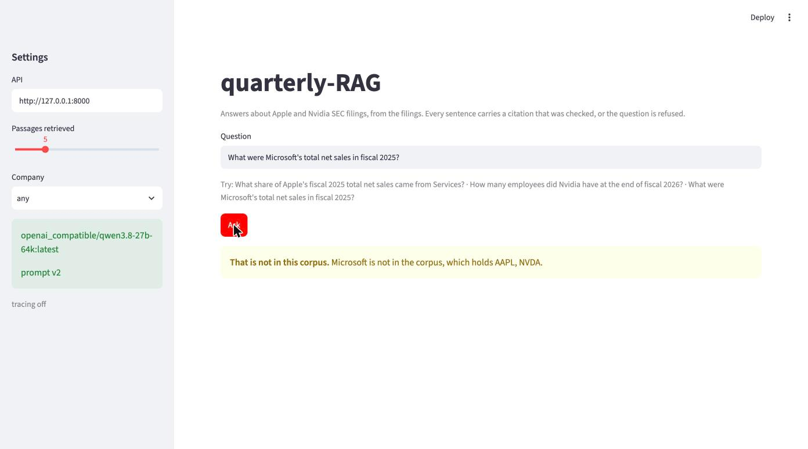

# quarterly-RAG

[](https://github.com/kvnzhng/quarterly-RAG/actions/workflows/ci.yml)

> Local, open-source Retrieval-Augmented Generation over SEC quarterly and annual filings (10-Q, 10-K), built to learn and demonstrate what "shipping a production RAG system" actually requires: **grounding, chunking, retrieval quality, hallucination control, and knowing when to refuse to answer.**

Everything runs on a laptop with no paid API: Ollama for the LLM and embeddings, ChromaDB for vectors, a local model as the judge. The model provider is your choice: point it at a model server on your network or at a hosted API by editing `.env`.

**Current state:** all three phases are built. The pipeline answers questions from the filings or refuses with a reason, every layer is measured against a 63-question human-verified eval set, and eleven decisions are recorded as ADRs, each backed by a tradeoff page with numbers. [Results](#results) has the tables, [the five competencies](#the-five-competencies-what-was-tried-what-was-measured-what-was-chosen) has the argument, and [what did not work](#what-did-not-work-and-what-it-taught) is the part worth reading first.

## Why filings?

10-Q and 10-K reports are free, public, long, highly structured, and full of exact numbers. That makes them a good corpus for RAG: retrieval is non-trivial (the same sections repeat every quarter), grounding is checkable (a revenue figure is either in the filing or it is not), and refusal has a concrete meaning (the period or company is not in the corpus).

Starting companies: **Apple (AAPL)** and **Nvidia (NVDA)**. Adding a ticker is a config change.

## Architecture

```
EDGAR (10-Q / 10-K) --> ingestion --> chunking --> indexing --> retrieval --> generation --> answer | refusal
                        parse to      pluggable    embed +     dense + BM25,  grounded prompt,
                        sections      chunkers     Chroma/FAISS RRF, filters   citation check, refusal gate
                                                              \_______ evaluation + Langfuse traces _______/
```

A question goes through `pipeline.py` in six steps, and the same path serves `POST /ask`:

1. **Scope gate, before any model call.** A company the corpus does not hold, a year before it, or a question filings never answer (advice, live prices) is refused as `out_of_scope`. In a trace that is two spans and one millisecond.
2. **Read the question** for a company and a fiscal period. A named company becomes a ticker filter and a named quarter a period filter; a bare year is never filtered, because filings quote prior years. A question naming two companies asks each separately and interleaves the results by rank.
3. **Retrieve** the top 50 from dense search and the top 50 from BM25, fuse them by reciprocal rank, keep 5. A filter that empties the result falls back to no filter.
4. **Generate** with the passages tagged `[c1]` to `[c5]`. The prompt requires a citation on every sentence and the sentinel `INSUFFICIENT_EVIDENCE` when the passages do not answer.
5. **Verify deterministically.** Every citation must name a passage that was provided, and every figure must appear in the passage it cites after unit scaling. A figure no passage prints is labelled `derived`; if the answer wrote a `CALC:` line for it, each operand is checked against the passage it cites and the arithmetic is recomputed.
6. **Answer gate.** The sentinel refuses as `insufficient_evidence`; an answer with no resolvable citation refuses as `verification_failed`. A refusal carries its reason and the closest passages.

Every chunk carries ticker, form, fiscal period, section and character offsets into one canonical text per filing, and the eval labels are spans into that same text, so a label survives a change of chunker. `docs/architecture.md` has the data model and the component table; every row of that table is a tradeoff page with numbers and an ADR.

## Results

The eval set is 63 questions, each verified against the filing by hand: 23 `lookup`, 5 `derived`, 5 `cross_period`, and 30 that must be refused. Every number below names the model, the chunker and the count behind it. On 33 answerable questions one question is three percentage points, so these numbers separate large effects, not small ones.

### The gate

`make eval` compares nine numbers with `data/eval/baseline.json` and fails on a drop of more than five points. Default configuration: section-aware chunks, hybrid retrieval with the quarter filter, `gpt-oss:20b` answering, `qwen3.8-27b-64k` judging, prompt v1. Recorded 2026-09-04.

| Metric | Value | What is behind it |
|---|---|---|
| recall@5 | 48.5% | 16 of 33 answerable questions have a gold chunk in the top 5 |
| MRR | 0.440 | over the top 10 |
| nDCG@5 | 0.406 | |
| citations resolve | 100% | every citation in every answer names a passage that was provided |
| fully grounded | 87.5% | 14 of the 16 `lookup` questions the model answered; the other 7 were refused |
| judged correct | 93.8% | 15 of 16 |
| faithfulness | 75% | 12 of 16 judged sentences, reported with the judge's own miss rate below |
| abstention F1 | 0.812 | 63 questions, 30 of them must be refused |
| answerable coverage | 66.7% | 22 of 33 answerable questions attempted |

The gate was re-run twice on 2026-09-05 at the commit of this writeup, before any number above was quoted, and the two runs agree with each other to three decimals. Every deterministic metric reproduced the baseline exactly, and so did citations resolve, fully grounded and judged correct. Three did not: answerable coverage 66.7% to 63.6% (one more question refused), abstention F1 0.812 to 0.800, and faithfulness 75% to 62.5% (two of 16 judged sentences), which fails the gate's five-point tolerance. The gate writes no per-question report, so the generation eval was run on its own and compared question by question with the baseline-day report: `gpt-oss:20b` at temperature 0 gave byte-identical answers on 13 of 23 questions across the two days, the judge flipped two verdicts on sentences whose only change was a space before a percent sign and the position of a citation tag, and its dangerous direction, looser, stayed at zero. The model tags and their digests were unchanged since August and so was the server version; server-side state is the candidate cause, unverified. The baseline stays as recorded: no code change caused this, and accepting the lower numbers would bury the finding. What it says about the gate is in the findings below.

### How retrieval got there

33 answerable questions, `nomic-embed-text`, ChromaDB, a chunk counting as relevant when it overlaps a gold span. Each row keeps everything above it. MRR is over the top 10.

| Change | recall@1 | recall@5 | recall@10 | MRR |
|---|---|---|---|---|
| dense only, fixed chunks, raw text | 3.0% | 15.2% | 24.2% | |
| + the embedding model's task prefixes, which were missing | 9.1% | 18.2% | 24.2% | 0.131 |
| + a provenance header on every chunk before embedding | 18.2% | 36.4% | 45.5% | 0.266 |
| + BM25, fused by reciprocal rank, candidate pool 50 | 21.2% | 45.5% | 45.5% | 0.300 |
| + a filter on the fiscal quarter the question names | 21.2% | 48.5% | 51.5% | 0.306 |
| + section-aware chunks (the default) | **39.4%** | **48.5%** | **57.6%** | **0.440** |

At the default, the top five reach the right filing for every question, the right section for 78.8%, and a chunk holding the evidence for 48.5%. Retrieval finds the document and then loses inside it, which is why the levers that mattered were what gets embedded and where the chunk boundaries fall, not the store or the filter on the company.

### What the chunker decides

Four chunkers, one set of labels, the same hybrid retriever, re-measured at the commit of this writeup on 2026-09-05 with retrieval depth 20. Chunk counts are over the 16 filings.

| Chunker | Chunks | recall@1 | recall@5 | recall@10 | recall@20 | MRR |
|---|---|---|---|---|---|---|
| fixed window, tables never split | 1,391 | 21.2% | 48.5% | 51.5% | 63.6% | 0.314 |
| recursive, structure-blind | 1,213 | 15.2% | 27.3% | 51.5% | 66.7% | 0.243 |
| **section-aware**, cut on the filing's own sub-headings | 2,891 | **39.4%** | 48.5% | **57.6%** | **72.7%** | **0.449** |
| parent-child, small children, titled parent returned | 4,704 | 27.3% | 45.5% | 57.6% | 63.6% | 0.348 |

MRR here is over the top 20, which is why section-aware reads 0.449 against the gate's 0.440 over the top 10: the same ranking, cut at a different depth.

### Which model

23 `lookup` questions, prompt v1, fixed chunks, k=5, a 1024-token answer budget. "Gold" hands the model the passages holding the evidence, which isolates the generator; "retrieved" runs the whole pipeline, so retrieval's misses are inside the number.

| Model | Passages | Citations resolve | Fully grounded | States the labelled figure | Seconds per answer |
|---|---|---|---|---|---|
| `llama3.1:8b`, the laptop default | gold | 50% | 41% | 95% | |
| `gpt-oss:20b` | gold | 100% | 91% | 77% | |
| `qwen3.6:27b` | gold | 100% | 100% | 64% | |
| `qwen3.8-27b-64k` | gold | 100% | 91% | 91% | |
| `gpt-oss:20b` | retrieved | 100% | 87% | 67% | 3.8 |
| `qwen3.8-27b-64k`, recommended | retrieved | 100% | 100% | 75% | 9.6 |

### Arithmetic

The 5 `derived` and 5 `cross_period` questions need a number no filing prints. Gold passages, the judge always a different model from the generator, counts rather than rates because ten questions cannot carry a percentage.

| Generator | Prompt | Answered | Calculations verified | Every figure accounted for | Judged correct |
|---|---|---|---|---|---|
| `qwen3.8-27b-64k` | v1, arithmetic forbidden | 6 of 10 | none written | 6 of 6 | 4 of 6 |
| `qwen3.8-27b-64k` | v2, `CALC:` lines recomputed | 10 of 10 | 8 of 8 | 8 of 10 | 10 of 10 |
| `llama3.1:8b` | v1 | 9 of 10 | none written | 4 of 9 | 8 of 9 |
| `llama3.1:8b` | v2 | 10 of 10 | 7 of 10 | 7 of 10 | 8 of 10 |

Under v1 the two models fail in opposite directions: `qwen3.8-27b-64k` refuses 4 of the 5 `derived` questions outright, and `llama3.1:8b` answers them with 7 figures that no cited passage contains. A refusal and a hallucination are both what "no calculation provenance" looks like, at the two ends of instruction following.

## The five competencies: what was tried, what was measured, what was chosen

**Grounding.** Provenance was designed in at ingestion rather than added later: the parser writes one canonical text per filing, and every offset in the project, whether section, chunk, gold label or citation, indexes into that string. The prompt shows the model its passages as `[c1]` to `[c5]` and requires a citation on every sentence, and a deterministic verifier then checks that each citation names a passage that was provided and that each figure appears in the passage it cites, after unit scaling. Measured on the same prompt across four models, citation discipline turned out to be a model capability rather than a prompting problem: every model at 20B or above produced resolvable citations 100% of the time, while `llama3.1:8b` invented passage labels it was never given in half its answers and was at the same time the best of the four at finding the right figure, at 95%. Grounding also held when retrieval degraded. Moving from gold to retrieved passages left citation resolution at 100% and `qwen3.8-27b-64k` fully grounded on every answer, while refusals rose from 0% and 4% to 30% and 35%: the system says it cannot answer rather than making something up. What was chosen: the verifier has the last word, and it costs 4 ms against 8,423 ms of generation in a trace; `qwen3.8-27b-64k` is the recommended model as the only one measured that is both fully grounded and accurate, and the 8B model stays the code default only because ADR-003 says the defaults fit a laptop. The verifier's limit is named: it checks that a figure is present in the cited passage, not that the claim about it is true, so a figure read from the wrong column passes. `docs/learning/grounding.md`, RAG-004, RAG-010, RAG-025.

**Chunking.** Four chunkers were built behind one protocol and scored on the same labels: a fixed window that never splits a table, a structure-blind recursive splitter, a section-aware chunker that cuts on the filing's own sub-headings, and parent-child, which retrieves small children and hands the generator the titled block around them. Because the labels are spans into the filing text rather than chunk ids, re-chunking never invalidated them. With the same hybrid retriever, section-aware nearly doubled recall@1, from 21.2% to 39.4%, and lifted MRR by 43% while leaving recall@5 unchanged at 48.5%: chunking decided where the evidence landed, not whether it was found. End to end that mattered more than the recall number suggests, because the generator reads the top passage first, and the share of answers stating the labelled figure rose from 75% to 93% with `qwen3.8-27b-64k`. The recursive splitter left 221 chunks holding half a table, which is what ignoring the document costs, and parent-child came second because a 69-word child cut by word count still crosses topics while a titled block does not. Section-aware is the default (ADR-009); the index doubles to 2,891 chunks and a full rebuild takes eight seconds longer. `docs/learning/chunking.md`, `docs/tradeoffs/chunking.md`, RAG-005, RAG-020.

**Retrieval quality.** The eval set came before the index: 43 questions, later 63, drafted with a model and every one verified against the filing by hand, with evidence labelled as spans so one label set scores every chunker, store and retriever. That ordering found the first bug. `nomic-embed-text` is trained with `search_query:` and `search_document:` prefixes and was getting neither, which raised no error and cost a third of recall@5; the fix lives in the `Embedder` interface, which now has separate document and query methods so the mistake cannot be expressed. A one-line provenance header on each chunk before embedding then doubled recall at every cutoff, because a chunk of a financial table names neither its company nor its period. From there each lever was measured against the last. BM25 alone scored six points below dense and fusing the two by reciprocal rank scored nine points above it, because they fail on different questions. Filtering on the company changed nothing, since retrieval already reached the right filing 91% of the time, while filtering on the quarter the question names moved the seven 10-Q questions off zero, because eight near-identical income statements stopped competing. Reranking with a chat model raised recall@1 and lowered recall@5, and the generator reads five passages, so it is off. ChromaDB and FAISS gave identical recall with the store at 3% of a retrieval, so the store was chosen on upsert and native filtering rather than speed. The default is hybrid retrieval with the quarter filter over section-aware chunks in ChromaDB (ADR-008, ADR-010). The ceiling is real: 9 of 33 questions have their evidence below rank 20, and the first candidate explanation is in the findings below. `docs/learning/retrieval-quality.md`, `docs/tradeoffs/retrieval-strategies.md`, `docs/tradeoffs/vector-stores.md`, RAG-019, RAG-006 to RAG-009, RAG-026.

**Hallucination control.** Six layers, each measured: a prompt that may only answer from the passages, the deterministic verifier above, calculation provenance, a cross-model judge, a regression gate, and the refusal policy below. Calculation provenance means a derived number is written as a `CALC:` line whose operands are each checked against the passage they cite and whose arithmetic is recomputed, because a verbatim check passes a wrong relationship between two correct numbers. The judge was calibrated before it was believed: against the verifier over 57 cited sentences it agreed 86% of the time, was stricter on 6 and looser on 2, and those 2 are a quarter of the 8 sentences whose figures were not in their passage, so every faithfulness number is reported with that miss rate beside it. It earns its place by catching what the verifier cannot: "a $15,381 million increase" passes a presence check because 15,381 is in the income statement, and the judge marks it unsupported. RAGAS was measured on the same passages and scored the faithful answers 0.0 and the unfaithful derived one 1.0 with two local judges, so it was rejected on measurement and its 45 packages removed. Calculation provenance took `qwen3.8-27b-64k` from refusing 4 of the 5 `derived` questions to answering all 10 with 8 of 8 calculations verified and 10 of 10 judged correct; `llama3.1:8b` shows its working and gets 3 of 10 calculations wrong, every failure an operand cited to a passage that does not contain it. It is opt-in, with `ANSWER_PROMPT_VERSION=2`, because the gate measured that the same prompt costs two of the 33 answerable questions with `gpt-oss:20b`. `docs/learning/hallucination-control.md`, `docs/tradeoffs/evaluation.md`, RAG-010, RAG-012, RAG-021, RAG-029.

**Refusal.** The gate has four named reasons because the fix for each is different: `out_of_scope` before any model call, `low_confidence` from the retrieval score, `insufficient_evidence` from the generator's own reading of the passages, and `verification_failed` when no citation resolves. Thirty questions that must be refused sit in the same file as the 33 that must be answered, so abstention precision and recall are scored together with coverage. The standard first answer, a retrieval-score threshold, was swept and is worse than useless on this corpus: cosine scores cluster between 0.74 and 0.84, and raising the threshold to 0.85 bought 3.3 points of abstention recall for 45 points of coverage. It is off, and 29 of the 43 refusals `qwen3.8-27b-64k` made came from the generator reading the passages. Abstention precision looked bad at 67% until the 14 over-refusals were checked one by one: 13 had no evidence in the top five, so coverage is bounded by retrieval and not by the gate, and the one that was a gate failure is the only bug in the number. Refusal calibration is also not answer quality: `llama3.1:8b` has the best abstention F1 at 0.824 and invents citations in half its answers, because the same willingness to assert produces both. One question leaks past every model, which customers account for Nvidia's largest sales, where the filings discuss the topic at length and never name anyone. A refusal is an HTTP 200 carrying its reason and the closest passages, because refusing answers the question. `docs/learning/refusal.md`, RAG-011.

## What did not work, and what it taught

Most of what this project learned is a negative result. Each is recorded with the numbers that produced it, because the next reader would otherwise re-run it.

- **Prompt wording moved the numbers more than the rule did.** Two wordings of the calculation rule differ only in where a worked example sits. With the example last, `llama3.1:8b` verified 9 of 13 calculations and `gpt-oss:20b` lost 11 points of faithfulness on the `lookup` questions, 75% to 64%, writing terse paraphrases in the example's style instead of the filing's words. With the example in the body, faithfulness came back to 73% and the 8B model verified 6 of 10. A worked example is a style anchor for every model in the prompt, not only for the behaviour it demonstrates.
- **The gate decided a default.** Turning calculation provenance on dropped answerable coverage from 0.667 to 0.606, two of 33 questions, and gave the identical number on a second run. So calculation provenance is opt-in, and a drop a change caused was not accepted as a new baseline.
- **Measuring one verifier found a defect in another.** The calculation checker reported an operand missing from a passage that printed it. Apple's operating expenses table ends a row with `$29,915` and the next line begins `Percentage of total net sales`; the figure pattern allowed any whitespace between a number and its unit, so it read 29,915 percent, and every answer quoting that figure had been scored ungrounded since the verifier was written. The first fix was too tight: `gpt-oss:20b` writes a narrow no-break space before a unit, and restricting the gap to a space dropped the unit from every figure it wrote.
- **A test passed while its feature did not.** The first tracing test called the scoring function and asserted the spans, and never read a score back, so it was green while nothing proved a score landed on a trace. It now filters the scores API by trace id and asserts the score is there, and absent for a bogus id.
- **Retrieval is unstable to phrasing, and only for Nvidia.** Asking one company for its annual total, filtered to that company: "Nvidia's revenue in 2025" ranks its income statement 2nd, "in fiscal 2025" 1st, and "Nvidia's total revenue in 2025" outside the top 6. The same edits leave Apple at rank 1, including when Apple is asked in Nvidia's vocabulary. Nvidia's filings say "revenue" and "total revenue" in every geographic and segment table, so the words do not discriminate, while Apple's "net sales" is nearly unique to the line item. Four deterministic rewrites were tried and none reached Nvidia's total, so none shipped. This is the first candidate explanation for the 9 questions whose evidence sits below rank 20, and it is RAG-032.
- **A judge passes arithmetic over an invented operand.** `llama3.1:8b` answered how much Nvidia's research and development spending grew with `CALC: 12,914 - 7,331 = 5,583`. The result is right, the arithmetic is consistent, and the judge scored it correct. But 7,331 appears in no passage; the real operands, 12,914 and 18,497, are both printed in the passage it cited. A presence check passes it and a judge passes it. Recomputing from cited operands is the only layer that refuses it, and it is the reason that layer exists.
- **Reranking made the system worse while making the ranking look better.** With a 20B model scoring ten candidates, recall@1 rose from 18.2% to 30.3% and recall@5 fell from 45.5% to 39.4%, at 14 seconds a question against 0.4. The generator reads five passages, so it is off.
- **The retrieval-score threshold is worse than useless** as a refusal signal here. The sweep only goes down, because cosine scores on this corpus do not separate a good match from a bad one.
- **RAGAS scored the faithful answers 0.0 and the one hallucination 1.0** with two different local judges, after pulling 45 packages and pinning LangChain back to install at all. It is not a dependency.
- **"Filtering buys nothing" shipped, and it was wrong.** It was true of the company filter and false of the quarter filter, and the page had to be corrected in a later ticket. A conclusion wider than its experiment is a bug.
- **FAISS is sixteen times faster per lookup and it changed nothing**, because the store is 3% of a retrieval and the embedding call is thirty times larger. Everything a vector database does became adapter code where a bug can hide, so ChromaDB stayed.
- **A thinking-mode model scored 43% until its answer budget rose from 400 to 1024 tokens.** A truncated answer scores as ungrounded, which blames the model for the budget. Comparisons are only fair at equal budgets.
- **Two harnesses disagreed on one measurement, in opposite directions.** `rag eval refusal` reported answerable coverage of 63.6% under prompt v1 and 66.7% under v2; the same eval inside `rag eval baseline` reported 66.7% and 60.6%. On 2026-09-05 the gate itself gave 63.6% under v1, the standalone's number. The disagreement is one question wide, the size of the cross-day variation in the next bullet, so a harness difference is now the less likely explanation. Not proven, and recorded as the current best one.
- **The gate is deterministic within a day and not across days.** Two runs an hour apart agreed on 2026-09-04, two runs agreed on 2026-09-05, and the two days disagree by one refused question and two judged sentences, with identical code, questions, model digests and server version. Faithfulness moves 6.25 points per sentence against a five-point tolerance, so that metric can fail the gate with nothing changed. The gate needs a tolerance no finer than each metric's granularity, per-question output, and either a seed on the server or several runs for the model-dependent metrics.

## What is still open

- **A quarter of the questions are out of reach.** recall@20 is 72.7%, so 9 of 33 answerable questions have their evidence below rank 20 after every lever above. The per-company phrasing instability is the first candidate explanation and needs labelled paraphrase pairs before anything is built (RAG-032).
- **The eval set concentrates its evidence in 6 of 16 filings, is 70% tables, and has no comparison or paraphrase questions.** A second labelling round would sharpen every retrieval number. The gate also scores the 23 `lookup` questions only, so calculation provenance is measured but ungated.
- **One question leaks past every model**: `q052`, which customers account for Nvidia's largest sales.
- **No hosted model has been measured, and the embedding model comparison was never run.** `nomic-embed-text` stays by default rather than by measurement. Both are a `.env` change and one eval run away.

## Quickstart

```bash
git clone https://github.com/kvnzhng/quarterly-RAG.git && cd quarterly-RAG

# 1. Python env (uv installs Python 3.12 if needed)
make setup

# 2. Config
cp .env.example .env   # set EDGAR_USER_AGENT (SEC requires a contact), and LLM_*/EMBED_* if not using local Ollama

# 3. Model provider, pick one (see "Choosing a model provider" below)
#    a) Ollama on this machine:
brew install ollama && ollama serve &
make models            # pulls the models named in .env through Ollama's HTTP API
#    b) Ollama on another machine: point LLM_BASE_URL / EMBED_BASE_URL at http://<host>:11434/v1 in .env, then
make models            # same command; the host is read from .env (or set OLLAMA_HOST)
#    c) a hosted API: nothing to install, just the token in .env

# 4. Sanity
uv run rag version
uv run rag config
make test
uv run rag doctor    # endpoint reachable, models listed, one chat + one embedding call, data dirs writable

# 5. Corpus: the last two years of 10-Q / 10-K filings, about eight per company, with a manifest
uv run rag ingest download --ticker AAPL --ticker NVDA
uv run rag ingest parse --ticker AAPL --ticker NVDA   # -> sectioned JSONL with offsets
uv run rag chunk build --ticker AAPL --ticker NVDA    # -> chunks with the same offsets
uv run rag index build --ticker AAPL --ticker NVDA --context   # -> embeddings in ChromaDB
uv run rag index query "What were Apple's total net sales in Q3 FY2026?" --context
uv run rag eval retrieval -k 5 --context   # -> recall@k, MRR, nDCG with a run record
uv run rag ask "How many employees did Apple have at the end of fiscal 2025?"

# 6. The same thing over HTTP, and a page for it
make api   # POST /ask on 127.0.0.1:8000, and /docs for the schema
make ui    # Streamlit on 127.0.0.1:8501, in another terminal
uv run rag eval refusal                    # -> abstention precision/recall and the threshold sweep
make eval                                  # -> every metric against data/eval/baseline.json
```

`rag --help` lists every command; each ticket's Verified line in `project/tickets.md` says what it was run against.

## Choosing a model provider

The pipeline reaches models through two small interfaces, `LLM` and `Embedder`, configured entirely from `.env` (ADR-005). The defaults keep everything on your machine and free; which provider you use is your call.

| Setup | `LLM_PROVIDER` | `LLM_BASE_URL` | `LLM_API_KEY` | Notes |
|---|---|---|---|---|
| Ollama on this machine (default) | `openai_compatible` | `http://localhost:11434/v1` | `ollama` (ignored) | `make models` pulls the weights |
| Ollama, vLLM, LM Studio, llama.cpp on another machine | `openai_compatible` | `http://<host>:<port>/v1` (the `/v1` matters) | whatever that server expects | nothing to install locally; for Ollama, `make models` pulls onto that host |
| Ollama on a machine with 18 GB+ (recommended) | `openai_compatible` | as above | as above | `LLM_MODEL=qwen3.8-27b-64k:latest`, the only model measured that is both fully grounded and accurate; `gpt-oss:20b` is 2.5x faster and less accurate. The 8B default fails citation discipline (`docs/tradeoffs/llm-serving.md`) |
| Hosted OpenAI-compatible API (OpenAI, OpenRouter, Groq, ...) | `openai_compatible` | the provider's URL | your token | costs money, so evals stop being free |
| Anthropic API | `anthropic` | unused | your token | `LLM_MODEL=claude-opus-5`; no embeddings endpoint, keep `EMBED_*` local |

Embeddings are configured separately (`EMBED_PROVIDER`, `EMBED_BASE_URL`, `EMBED_MODEL`) because a hosted chat model is usually best paired with local embeddings: the index gets rebuilt often and embedding cost adds up.

Every eval number in `docs/` carries a run record: git commit, corpus manifest hash, chunker config, embedding model, retrieval parameters, prompt version, and the provider and model that produced it. Local 8B model vs hosted frontier model on the same eval set is one of the planned comparisons (`docs/tradeoffs/llm-serving.md`).

## Repository layout

```
src/quarterly_rag/     pipeline layers: ingestion, chunking, indexing, retrieval, generation, evaluation, observability
tests/               unit tests (no network); integration tests are marked and skipped by default
data/                raw/, processed/, indexes/ are gitignored; eval/ sets are committed
docs/adr/            architecture decision records, one per real decision
docs/tradeoffs/      X vs Y comparisons; a page counts once it has measured numbers
docs/learning/       one page per competency: concepts, what this repo does, talking points
project/tickets.md   the roadmap as ordered tickets: one thin end-to-end path first, then comparisons
scripts/             repo tooling (commit message check used by the git hook and CI)
infra/               docker compose for Langfuse
notebooks/           exploration only
```

## Workflow

Work is ticket-driven. Each change references a ticket (`feat(retrieval): add BM25 (RAG-009)`). `make setup` installs a `commit-msg` hook that rejects messages without one, CI runs the same check over every push and pull request, and a Claude Code edit hook blocks edits with no active ticket. `AGENTS.md` is a symlink to `CLAUDE.md` so Codex follows the same rules. See `CLAUDE.md`.

## The page

`make api` serves `POST /ask`; `make ui` is a Streamlit page against it. The page shows what
a client of the API sees and never touches the pipeline itself, so what it displays is
exactly what the endpoint returned.



A figure no filing prints is only shown as verified when its operands are in the passages
they cite and the arithmetic comes out the same (RAG-021). Opening the citation shows the
passage with those operands marked, using the same check the verifier ran, so a highlight is
the evidence rather than decoration.



A question the corpus cannot answer is refused with a reason, and the closest passages are
offered so a reader can look for themselves.



## Status

Ordered as in `project/tickets.md`: one thin, measured end-to-end path first, then the comparisons.

- [x] RAG-001 scaffolding, tooling, roadmap
- [x] RAG-016 rename to quarterly-RAG
- [x] RAG-017 reading list
- [x] RAG-018 provider-agnostic model configuration
- [x] RAG-022 / 023 portable ticket enforcement, docs match the plan
- [x] RAG-002 model clients and `rag doctor`
- [x] RAG-003 EDGAR downloader with manifest
- [x] RAG-004 section parser
- [x] RAG-019 evaluation set v0 (43 questions, evidence spans, question types)
- [x] RAG-005 v1 chunker (fixed window, tables atomic)
- [x] RAG-006 embeddings, Chroma, dense retrieval
- [x] RAG-008 retrieval metrics, run record, baseline
- [x] RAG-010 grounded generation with verified citations
- [x] RAG-011 refusal policy with abstention metrics
- [x] RAG-009 hybrid retrieval (dense + BM25 fusion), the new default
- [x] RAG-020 chunking comparison, section-aware is the new default
- [x] RAG-007 vector store comparison, ChromaDB stays the default
- [x] RAG-012 faithfulness judge and the regression gate
- [x] RAG-021 calculation provenance for derived numbers
- [x] RAG-013 Langfuse tracing, optional and off by default
- [x] RAG-014 API and Streamlit page
- [x] RAG-029 three named limits of the calculation verifier
- [x] RAG-030 Enter submits a question in the page
- [x] RAG-031 a question naming two companies asks each of them
- [x] RAG-015 writeup
- [ ] RAG-032 retrieval is unstable to phrasing, per company

## The course

What this repository learned is written up as a public course: twelve chapters, one per
layer, each explaining the tooling, the alternatives that were tried and what the numbers
said, and a marimo notebook that drives the real pipeline so a reader can change the chunker,
the retrieval strategy, k, the filters, the prompt version and the model and watch the numbers
move. The chapters point at notebook sections and the notebook points back at the chapters.

- **Course:** https://flashy-fur-afc.notion.site/quarterly-RAG-a-course-on-production-RAG-3d21f11d4bc881a6b753c2c819817428
- **Notebook:** `notebooks/course.py`. Once the corpus, chunks and indexes exist, `make course`
  (or `uv run marimo edit notebooks/course.py` from the repository root) opens the editor in
  your browser. Sections 0 to 6 run on open and cost one embedding call per retrieval; every
  cell that calls a chat model waits for a run button. `uv run marimo run notebooks/course.py`
  shows the same notebook as an app without the code, and `uv run python notebooks/course.py`
  runs the ungated cells as a script and exits.

## Reading and courses

Grouped by the competency they support, in roughly the order the tickets need them. Every link was checked when added; papers link to arXiv abstracts.

**Start here**
- Lewis et al. 2020, [Retrieval-Augmented Generation for Knowledge-Intensive NLP Tasks](https://arxiv.org/abs/2005.11401). The paper that named the pattern.
- Gao et al. 2023, [Retrieval-Augmented Generation for LLMs: A Survey](https://arxiv.org/abs/2312.10997). Naive vs advanced vs modular RAG; a map of every lever this repo pulls.
- Barnett et al. 2024, [Seven Failure Points When Engineering a RAG System](https://arxiv.org/abs/2401.05856). Short and practical. Read before RAG-003.
- Eugene Yan, [Patterns for Building LLM-based Systems and Products](https://eugeneyan.com/writing/llm-patterns/). Evals, RAG, and guardrails in one long post.
- Course: DeepLearning.AI, [Building and Evaluating Advanced RAG](https://www.deeplearning.ai/short-courses/building-evaluating-advanced-rag/). Introduces the RAG triad: context relevance, groundedness, answer relevance.

**Grounding** (RAG-004, RAG-010)
- Anthropic, [Contextual Retrieval](https://www.anthropic.com/news/contextual-retrieval). Prepend document context to each chunk before embedding, with measured gains.
- Min et al. 2023, [FActScore](https://arxiv.org/abs/2305.14251). Split an answer into atomic claims and verify each one. The model for our citation verifier.
- Liu et al. 2023, [Lost in the Middle](https://arxiv.org/abs/2307.03172). Models under-use context placed mid-prompt, which affects how many chunks to pass and in what order.

**Chunking** (RAG-005, RAG-020)
- Jimeno Yepes et al. 2024, [Financial Report Chunking for Effective RAG](https://arxiv.org/abs/2402.05131). Element-based chunking of 10-Ks. Directly relevant.
- Chroma Research, [Evaluating Chunking Strategies for Retrieval](https://research.trychroma.com/evaluating-chunking). Token-level recall metrics for chunkers.
- Pinecone, [Chunking Strategies for LLM Applications](https://www.pinecone.io/learn/chunking-strategies/). Survey of the common strategies.
- Sarthi et al. 2024, [RAPTOR](https://arxiv.org/abs/2401.18059). Hierarchical summaries as retrieval units, the ambitious version of parent-child chunking.
- Course: DeepLearning.AI, [Preprocessing Unstructured Data for LLM Applications](https://www.deeplearning.ai/short-courses/preprocessing-unstructured-data-for-llm-applications/). Parsing HTML and PDF with tables.

**Retrieval quality** (RAG-006 to RAG-009)
- Karpukhin et al. 2020, [Dense Passage Retrieval](https://arxiv.org/abs/2004.04906). Why bi-encoders work for retrieval.
- Robertson and Zaragoza 2009, [The Probabilistic Relevance Framework: BM25 and Beyond](https://doi.org/10.1561/1500000019). The sparse baseline that still wins on exact terms.
- Cormack et al. 2009, [Reciprocal Rank Fusion](https://doi.org/10.1145/1571941.1572114). The one-formula way to merge dense and sparse results.
- Nogueira and Cho 2019, [Passage Re-ranking with BERT](https://arxiv.org/abs/1901.04085). Cross-encoder reranking.
- Khattab and Zaharia 2020, [ColBERT](https://arxiv.org/abs/2004.12832). Late interaction, the middle ground between bi-encoders and cross-encoders.
- Gao et al. 2022, [HyDE](https://arxiv.org/abs/2212.10496). Hypothetical document embeddings for query rewriting.
- Thakur et al. 2021, [BEIR](https://arxiv.org/abs/2104.08663) and the [MTEB leaderboard](https://huggingface.co/spaces/mteb/leaderboard). How embedding models are benchmarked, and why the leaderboard is not your corpus.
- Malkov and Yashunin 2016, [HNSW](https://arxiv.org/abs/1603.09320) and Johnson et al. 2017, [Billion-scale similarity search with GPUs](https://arxiv.org/abs/1702.08734). The index structures behind FAISS and Chroma.
- Weaviate, [Hybrid Search Explained](https://weaviate.io/blog/hybrid-search-explained).
- Courses: DeepLearning.AI, [Advanced Retrieval for AI with Chroma](https://www.deeplearning.ai/short-courses/advanced-retrieval-for-ai/); Hugging Face Cookbook, [Advanced RAG](https://huggingface.co/learn/cookbook/en/advanced_rag).

**Hallucination control** (RAG-010, RAG-012)
- Ji et al. 2023, [Survey of Hallucination in Natural Language Generation](https://arxiv.org/abs/2202.03629). Taxonomy and vocabulary.
- Manakul et al. 2023, [SelfCheckGPT](https://arxiv.org/abs/2303.08896). Sampling-based consistency checks without a reference answer.
- Dhuliawala et al. 2023, [Chain-of-Verification](https://arxiv.org/abs/2309.11495). The model drafts verification questions and answers them before finalizing.
- Asai et al. 2023, [Self-RAG](https://arxiv.org/abs/2310.11511) and Yan et al. 2024, [Corrective RAG](https://arxiv.org/abs/2401.15884). Retrieve, critique, and retry as a loop.

**Refusal** (RAG-011)
- Rajpurkar et al. 2018, [Know What You Don't Know (SQuAD 2.0)](https://arxiv.org/abs/1806.03822). Unanswerable questions as a first-class eval set. The template for `data/eval/unanswerable.jsonl`.
- Kamath et al. 2020, [Selective Question Answering under Domain Shift](https://arxiv.org/abs/2006.09462). Abstention as a calibrated decision, with coverage vs accuracy curves.
- Kadavath et al. 2022, [Language Models (Mostly) Know What They Know](https://arxiv.org/abs/2207.05221). Whether a model's own confidence is usable as a refusal signal.

**Evaluation** (RAG-019, RAG-008, RAG-012)
- Es et al. 2023, [RAGAS](https://arxiv.org/abs/2309.15217). Reference-free faithfulness, answer relevance, and context precision.
- Saad-Falcon et al. 2023, [ARES](https://arxiv.org/abs/2311.09476). Training lightweight judges with synthetic data.
- Zheng et al. 2023, [Judging LLM-as-a-Judge](https://arxiv.org/abs/2306.05685). Biases of LLM judges and how to check for them.
- Hamel Husain, [Your AI Product Needs Evals](https://hamel.dev/blog/posts/evals/). The practitioner's version: look at your data and build the harness first.

**Financial documents** (RAG-003, RAG-004, RAG-019)
- Islam et al. 2023, [FinanceBench](https://arxiv.org/abs/2311.11944). QA over 10-Ks with measured RAG failure rates. A source of question styles.
- Chen et al. 2021, [FinQA](https://arxiv.org/abs/2109.00122). Numerical reasoning over financial tables.
- Loukas et al. 2021, [EDGAR-CORPUS](https://arxiv.org/abs/2109.14394). A sectioned 10-K corpus, useful for the Item detection in RAG-004.
- SEC, [EDGAR APIs](https://www.sec.gov/search-filings/edgar-application-programming-interfaces), [fair access policy](https://www.sec.gov/os/accessing-edgar-data), and [How to Read a 10-K](https://www.sec.gov/files/reada10k.pdf).

**Tooling**
- [LangChain RAG tutorial](https://python.langchain.com/docs/tutorials/rag/), [LlamaIndex production RAG guide](https://docs.llamaindex.ai/en/stable/optimizing/production_rag/), [Chroma](https://docs.trychroma.com/), [FAISS wiki](https://github.com/facebookresearch/faiss/wiki), [sentence-transformers](https://sbert.net/), [RAGAS](https://docs.ragas.io/), [Langfuse](https://langfuse.com/docs), [Ollama](https://docs.ollama.com/).
- Course: DeepLearning.AI, [LangChain: Chat with Your Data](https://www.deeplearning.ai/short-courses/langchain-chat-with-your-data/).

**Books and foundations**
- Chip Huyen, *AI Engineering* (O'Reilly, 2025). Chapters on RAG, agents, and evaluation methodology.
- Jay Alammar and Maarten Grootendorst, *Hands-On Large Language Models* (O'Reilly, 2024). Embeddings, semantic search, and RAG with code.
- Stanford [CS224N](https://web.stanford.edu/class/cs224n/) for the NLP foundations (attention, retrieval, evaluation).

## License

MIT
