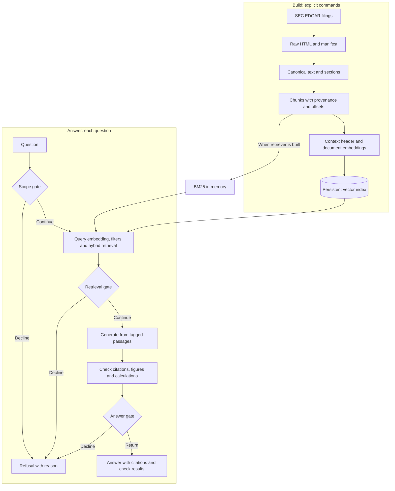
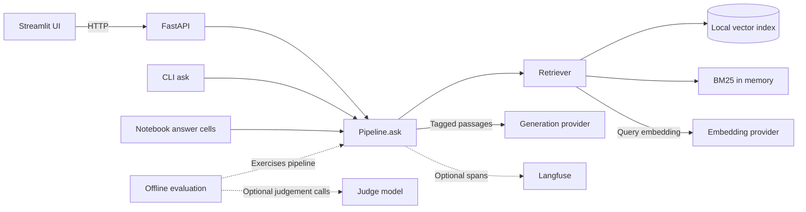

# Architecture

This is the implementation reference for quarterly-RAG, checked against the code for
RAG-049 on 2026-09-07. For the reasoning, pros and cons, exercises and further reading,
start with [Learning: architecture](learning/architecture.md).

The application is a modular Python pipeline: retrieval and verification run in the
calling process, while model calls cross a configurable provider boundary. The web
interface adds an API process and a separate UI process. Optional tracing adds another
service. Package boundaries do not imply a service per package.

## Two paths: build the evidence, then answer questions

Building prepares reusable data. Answering reads that data and embeds the question;
it does not download filings or embed all the documents again.

The vector store defaults to ChromaDB, with FAISS implementations available. BM25 is
constructed from saved chunks in `build_retriever`; it is not a second persisted database
produced by `rag index build`. The search branches produce two ranked lists; the diagram
does not imply that they execute concurrently.

## Processes and dependencies

The API builds its pipeline at startup and maps its result to the HTTP response schema.
The CLI builds a pipeline for its invocation. Notebook answer cells use the same class;
other notebook cells deliberately call lower layers to isolate an experiment.
Embedding, generation and judging are separate roles; configuration may place them on
the same server. Evaluation exercises individual layers as well as the pipeline. The
judge is used by evaluation, not by the normal `ask` answer gate.

`Settings` and factory functions select implementations. `Pipeline` receives a
`Retriever`, an `LLM`, gate settings and a `Tracer`; tests can supply fakes. Protocols
also define interchangeable chunker, embedder and vector-store boundaries. The concrete
judge currently wraps an LLM; it is not a separate `Judge` protocol.

The layer-order rule in [the conventions](../project/conventions.md) expresses the
intended dependency direction. It is not an enforced description of every import:
the optional retrieval reranker imports the LLM interface from generation, and the API
factory currently imports `gate_settings` from evaluation. Those are existing coupling
points to understand when changing the wiring.

## What each boundary carries

| Object | Responsibility and important fields | Source |
|---|---|---|
| `SectionRecord` | Filing identity, fiscal period, section title, canonical text location and offsets | [ingestion/records.py](../src/quarterly_rag/ingestion/records.py) |
| `Chunk` | Passage text, strategy, provenance, `char_start`/`char_end`; optional parent offsets | [chunking/base.py](../src/quarterly_rag/chunking/base.py) |
| `RetrievedChunk` | A chunk plus score, rank and retriever name; score is not a probability of correctness | [retrieval/base.py](../src/quarterly_rag/retrieval/base.py) |
| `Answer` | Prose, citations, unsupported sentences, derived figures, calculation checks, invalid tags, model and truncation metadata | [generation/answer.py](../src/quarterly_rag/generation/answer.py) |
| `Citation` | Local tag, chunk ID, ticker, form, period, section, source URL and display excerpt | [generation/answer.py](../src/quarterly_rag/generation/answer.py) |
| `GateOutcome` | Optional answer and refusal, retrieved passages, trace ID; a refused generated answer may be retained internally | [generation/refusal.py](../src/quarterly_rag/generation/refusal.py) |
| `AskResponse` | API answer or refusal; maps internal objects to the client contract | [api/models.py](../src/quarterly_rag/api/models.py) |
| `EvalQuestion` / `EvidenceSpan` | Question, type, gold answer and evidence offsets into canonical filing text | [evaluation/questions.py](../src/quarterly_rag/evaluation/questions.py) |
| `RunRecord` | Commit and dirty flag, corpus/eval hashes, parser/chunker/embedding facts, retrieval and overlap settings, timestamp | [evaluation/retrieval_eval.py](../src/quarterly_rag/evaluation/retrieval_eval.py) |

Canonical text is the coordinate system shared by sections, chunks and labels.
Re-chunking preserves label meaning while that text stays unchanged. Re-parsing can
change the text and invalidate offsets, so labels must be checked again. A citation
points to the retrieved chunk; it does not itself contain character offsets. The API
joins the passage back from the retrieval results for display.

`Answer.fully_grounded` is the project's deterministic check result: sentences have
citations, tags resolve, and figures are stated or verified through calculations. It
does not prove that the cited text entails the prose. Generation reports separately
record the answer model and optional judge alongside their run record.

## Request flow and refusal policy

The implementation is [pipeline.py](../src/quarterly_rag/pipeline.py). Defaults below
describe configuration, not a new benchmark.

1. **Scope gate.** Heuristics check topic patterns, known absent companies and some
   year requests. A match returns `out_of_scope` before retrieval. This is not a
   complete semantic scope classifier: read `check_scope` before relying on an edge case.
2. **Retrieve.** For the default hybrid strategy, infer a ticker and an explicit fiscal
   quarter from the question. A bare year does not become a period filter. Caller
   filters take precedence; an empty inferred-filter result retries with the caller's
   original filters, preserving explicit restrictions.
3. **Fuse rankings.** Dense and BM25 each supply a candidate pool (default 50); reciprocal
   rank fusion combines their ranks, then returns `k` passages (default 5). With multiple
   named companies and no caller ticker, the wrapper retrieves separately per company
   and interleaves ranks. That branch applies company/caller filters, without separately
   inferring a quarter. The optional model reranker is off by default.
4. **Retrieval gate.** No results returns `low_confidence`. The optional score threshold
   uses the top result score and defaults to zero. Rank or similarity is not a calibrated
   confidence in the answer.
5. **Generate.** Passages receive request-local tags such as `[c1]`. The prompt asks for
   cited sentences or `INSUFFICIENT_EVIDENCE`. Prompt v2 enables instructions for `CALC:`
   lines; verification can parse calculation lines whenever they are present.
6. **Verify.** Resolve tags, check figures with unit scaling, and recompute calculations
   after checking cited operands. Attach markers and structured results to the answer.
   A wrong table column can still pass a presence check.
7. **Answer gate.** The sentinel returns `insufficient_evidence`. Otherwise, no sentence
   with a resolvable citation returns `verification_failed`. Other failures are surfaced
   as annotations; they do not automatically cause refusal.
8. **Return.** The API returns either the answer and its checks or a refusal and available
   nearby passages. A deliberate refusal is HTTP 200. An unavailable pipeline is 503;
   a caught model-server failure is 502. The UI displays the API result.

Tracing wraps these steps when configured. Export failures are isolated from answer
content, though tracing can add latency. A missing tracer uses `NullTracer`.

## Build artifacts and change impact

| Artifact | Produced by | Used by | What makes it stale |
|---|---|---|---|
| `data/raw/<ticker>/` | Downloader and manifest writer | Parser | New or changed source filings |
| `data/processed/<ticker>/` | Parser | Chunkers, label checks, evidence display | Source or parser changes |
| `data/chunks/<strategy>/<ticker>/` | Chunk builder | Document embedding, BM25, corpus scope, evaluation | Canonical text or chunk-boundary changes |
| `data/indexes/<store>/<strategy>/<variant>/` | Index builder | Dense retrieval and run metadata | Chunks, embedding model, prefixes or embedded text change |
| `data/eval/questions.jsonl` | Human-reviewed labelling | Evaluation | Canonical text changes or revised labels |
| `reports/` | Evaluation commands, beside the configured data directory | Analysis and comparisons | New runs create new reports |

Use matching document and query embedding conventions. The index manifest records its
build facts, but this is not a transactional snapshot system that automatically guards
every configuration mismatch. Rebuilding also does not atomically publish a matching
vector index, chunk set and in-memory BM25 instance to a running API. Restart/reload and
artifact compatibility are operational responsibilities in the current local workflow.
Changing a prompt needs generation evaluation, not document re-embedding.

## Component choices and evidence

These links preserve existing experiment records; this documentation change did not
rerun them or measure a new architecture against alternatives.

| Component | Implemented choice | Evidence and qualification |
|---|---|---|
| Corpus | SEC primary 10-Q / 10-K documents | [ADR-004](adr/004-corpus-sec-filings.md) |
| Parser | Custom block-boundary parser | [Parsing](tradeoffs/parsing.md), [ADR-007](adr/007-custom-filing-parser.md); other parsers not benchmarked |
| Chunker | Section-aware default; fixed, recursive and parent-child available | [Chunking](tradeoffs/chunking.md), [ADR-009](adr/009-section-aware-chunking.md) |
| Embeddings | Separate provider; task prefixes and context header | [Embeddings](tradeoffs/embeddings.md); model comparison remains open |
| Vector store | ChromaDB default; FAISS flat/HNSW available | [Vector stores](tradeoffs/vector-stores.md), [ADR-010](adr/010-chromadb-default-store.md) |
| Retrieval | Filtered hybrid dense/BM25 with RRF | [Retrieval](tradeoffs/retrieval-strategies.md), [ADR-008](adr/008-hybrid-retrieval-default.md) |
| Generation | Configurable provider; cited prompt and deterministic checks | [Model serving](tradeoffs/llm-serving.md), [ADR-005](adr/005-model-provider-configurable.md), [ADR-006](adr/006-model-selection.md) |
| Orchestration | Plain Python in the current dependency set | [Orchestration](tradeoffs/orchestration.md); no framework comparison has been run |
| Evaluation | Span labels, figure/calculation checks and optional model judge | [Evaluation](tradeoffs/evaluation.md); full pipeline refusal eval and separate layer evals |
| Tracing | Optional self-hosted Langfuse, implemented | [Observability](tradeoffs/observability.md), [ADR-011](adr/011-langfuse-tracing-optional.md) |
| Serving | FastAPI and a separate Streamlit HTTP client, implemented | [API](../src/quarterly_rag/api/app.py), [UI](../src/quarterly_rag/ui/app.py), RAG-014 |

## Current limits

This is a local workflow with explicit builds and fixed retrieval rules, including
inferred-filter fallback. There is no loop that searches again after a weak answer, no online judge in the
answer gate, and no automatic source refresh. Authentication, per-user document access,
load-tested capacity, atomic index rollout and rollback are not established by the
current architecture. The learning chapter explains when those needs would justify
changing a boundary and what that change would cost.
