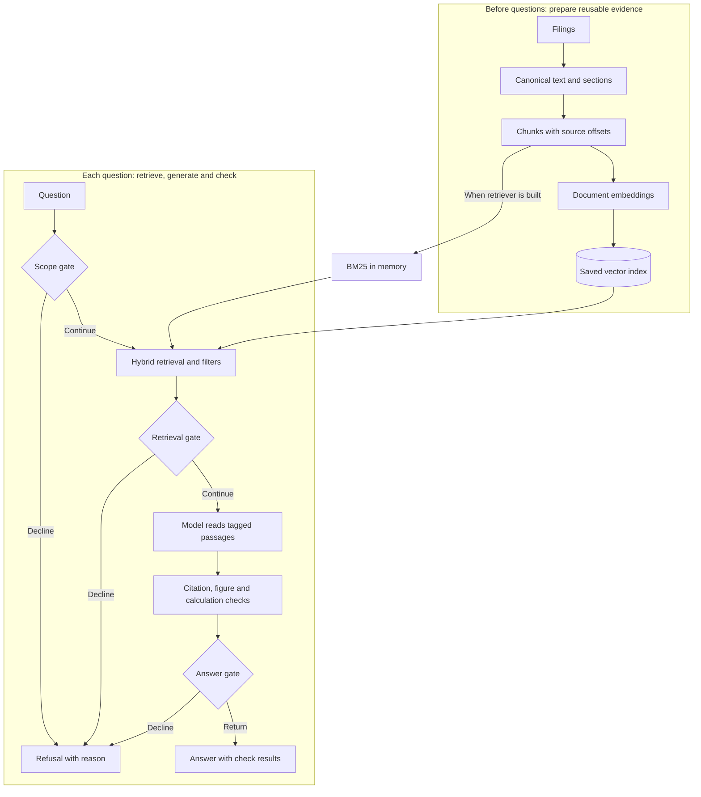

# Architecture: how the pieces fit, and why

RAG-049 · A companion chapter for the quarterly-RAG course.

Read this after the course introduction and before the individual pipeline layers.
You need the idea of RAG—a model answers using retrieved passages—but no architecture
vocabulary. By the end, you should be able to draw both paths through the project,
explain its major boundaries, and say when a different design would be worth its cost.
The [architecture reference](../architecture.md) maps these ideas to the current code.

## Start with the jobs the system has to do

Imagine answering a question with a shelf of annual reports. Before the first question,
someone downloads the reports, makes their text searchable and records where passages
came from. When a question arrives, someone finds candidate passages, writes an answer,
and checks the references. Preparing the shelf and answering from it have different
costs and different reasons to run.

That is the first architectural decision: separate the **build path** from the
**question path**. “Offline” here means outside a user request, not disconnected from
the internet; downloading filings and embedding documents can still call services.

Dense retrieval embeds each question. Document embeddings are reused; BM25 is loaded
from chunks when the retriever is constructed. The model judge is an evaluation tool
outside this request diagram. A diagram that places a judge after every answer would
describe a different system.

## The shape of this application

The core is a **modular application**: Python packages own distinct responsibilities,
and ordinary function calls connect them. The API and UI are separate processes, and
model providers may be separate services. Ingestion, retrieval and verification do not
each need their own server merely because they have their own directory.

An **interface** describes what a component must do. An **adapter** implements it for a
particular tool. For example, dense retrieval asks a `VectorStore` to search; the selected
adapter handles ChromaDB or FAISS. The pipeline receives its retriever and model as
dependencies instead of constructing a specific provider inside every step. This is
dependency injection applied with ordinary Python objects. The distinction between
assembly and use is explained in [Martin Fowler's dependency injection article](https://martinfowler.com/articles/injection.html).

The same idea applies to entry points. The CLI and API call `Pipeline.ask`; the UI calls
the API; notebook answer cells call the pipeline, while experiment cells can call a
single layer. The core can also be driven by tests with fake models and retrievers.
That resembles [ports and adapters architecture](https://alistair.cockburn.us/hexagonal-architecture):
keep application decisions usable through different external connections. This repo
borrows that idea without claiming a completely isolated domain core; its factories
still contain some dependencies across the intended layers.

## Decisions, benefits and costs

These are explanations of the implemented design and conditions for revisiting it.
They are not benchmark results for architectures we have not built.

| Decision | What it buys here | What it costs or leaves open | When to reconsider |
|---|---|---|---|
| Build documents before questions arrive | Reuse parsing and embeddings; inspect saved artifacts independently | Freshness needs explicit rebuilds; saved chunks and indexes can get out of step | Filings must become searchable on a deadline: add scheduled ingestion and versioned publication |
| Keep the core in one Python application | Follow a request directly; test components without network hops between layers | One process owns retrieval memory; components cannot scale independently | Measurements show distinct scaling or deployment needs for ingestion, retrieval or answering |
| Use a fixed workflow | Known order of checks and bounded search stages; easy to replay failures | A missed passage stays missed during that request | Labelled questions show that decomposition or another search materially helps |
| Put interchangeable tools behind interfaces | Run comparisons through a shared contract; replace providers in tests | Adapter code needs maintenance; a common contract can hide useful provider features | Expose a new capability only when a measured use case needs it |
| Preserve a canonical text coordinate system | Trace labels, chunks and citations back to a filing; compare chunkers with the same labels | Parser edits can invalidate offsets; table context can still be lost | Add structured table or cell provenance where text spans cannot express the evidence needed |
| Separate verification from the model call | Inspect and test numeric checks without generating another answer | Presence and correct arithmetic do not establish the meaning of a claim | A labelled failure set justifies semantic checking or a stricter return policy |
| Keep the model judge in evaluation | Study answer quality without adding a judgement call to every request | Runtime answers receive no semantic judge verdict | A product requirement justifies the latency and a calibrated judge's remaining errors |
| Make tracing optional | Diagnose stages without requiring tracing infrastructure to answer | Export failures can be quiet; configured tracing adds operational cost and latency | A deployed service needs stronger telemetry availability and retention guarantees |
| Keep the UI behind the API | All web clients see one answer/refusal contract | Run two processes and maintain the HTTP schema | A simple local demonstration may need only the CLI; more clients make the API boundary more valuable |

Splitting into services would add contracts, deployment coordination and partial
failures as well as scaling options. A model-controlled search loop would add another
set of decisions to evaluate. Neither change follows automatically from the word
“production”; each should address an observed requirement.

## Why retrieval, instead of putting all the filings in the prompt?

Retrieval selects a small working set and supplies source identities alongside it.
Its cost is selection error: the right passage may never reach the generator. Supplying
whole filings can avoid chunk selection within those filings, but requires choosing
which filings to supply and spending context and inference budget on them.

The [original RAG paper](https://arxiv.org/abs/2005.11401) is useful background on combining
learned model knowledge with a retrievable document collection. Its jointly trained
retriever/generator setup is not the implementation in this repository, which connects
separately configured components.

[Lost in the Middle](https://arxiv.org/abs/2307.03172) studies how evidence position
affects performance in the models and tasks it tested. It is a reason to measure how
a model uses a larger context, not proof that today's configured model will behave
identically. This project has not benchmarked a whole-filing prompt against its RAG
pipeline. A fair experiment would use the same questions, source availability, answer
requirements and declared resource budgets, then report quality and cost together.

## Why a workflow, instead of an agent?

In this project, code chooses the next stage. The generator chooses the words of an
answer or signals insufficient evidence; it does not decide to fetch another filing,
change the retrieval strategy or keep searching. Even the multi-company path is a
coded rule: retrieve for each company and interleave the rankings.

Anthropic's [Building effective agents](https://www.anthropic.com/engineering/building-effective-agents)
distinguishes predefined workflows from systems where the model controls subsequent
actions. That distinction is useful here. A workflow makes the current experiment
easier to attribute. An agent could respond to a missing operand by searching again,
but would need limits on calls, stopping rules, evidence tracking across searches and
evaluation of those additional decisions. The article supplies design vocabulary;
it is not a benchmark of this corpus.

The [orchestration tradeoff page](../tradeoffs/orchestration.md) explains why plain Python
is the current implementation and what a framework comparison would have to establish.

## Follow one question across the boundaries

Consider: “What were Apple's total net sales in Q3 FY2026?” This is a code walkthrough,
not a claim that a new live run answered it.

1. The scope gate checks its configured heuristics. Passing means the question may
   proceed; it does not prove the corpus contains the answer.
2. The retrieval wrapper infers company and quarter filters. Dense search uses a query
   embedding; BM25 uses terms, including expanded fiscal-period terms. Rank fusion
   selects passages from their candidate lists.
3. The prompt labels the selected passages. A label such as `[c1]` means the first
   passage in this request, not a persistent identifier for an SEC filing.
4. The model writes an answer or the insufficient-evidence sentinel. The verifier
   resolves tags and checks numbers against the corresponding passages.
5. The answer gate refuses the sentinel or prose with no resolvable citation.
   Otherwise the returned answer includes whatever check failures were found.
6. The API maps that outcome to an answer or refusal. The UI can show both the passage
   and the check result; optional traces explain the stages that produced them.

The last two steps contain a consequential design choice. A verifier can **detect** a
problem without the return policy **blocking** the answer. Currently a resolvable
citation can coexist with an unverified figure or an unsupported sentence. The checks
are exposed to the reader. Tightening that policy would be a behaviour change needing
evaluation of both missed errors and newly refused answerable questions.

Also distinguish three claims: the passage exists; the number occurs in it; the
sentence accurately describes it. The first two can pass when the sentence uses the
wrong year's column. A verified calculation can use real operands but compute the
wrong relationship for the question. The architecture makes these checks inspectable;
it does not turn them into a proof of factual correctness.

## How the boundaries helped this project learn

These are lessons from recorded experiments, not new measurements for this chapter.
Follow the linked pages for configurations, counts and limitations.

| Observation in the project | Architectural lesson | Experiment record |
|---|---|---|
| Document and query task prefixes were missing | Give the embedder separate document/query methods so callers express the two roles | [Embeddings](../tradeoffs/embeddings.md) |
| Chunkers changed while gold labels remained usable | Label the source coordinate system, not a particular index's chunk IDs | [Chunking](chunking.md) |
| Generator results differed with gold versus retrieved passages | Test a component with controlled inputs as well as through the request path | [Grounding](grounding.md) |
| A calculation could be consistent over an invented operand | Keep operand provenance checks separate from arithmetic and model judgement | [Hallucination control](hallucination-control.md) |
| A faster store did not settle end-to-end latency | Measure time at component boundaries before changing the deployment design | [Vector stores](../tradeoffs/vector-stores.md) |
| Tracing failures could delay an otherwise valid answer | Isolate optional infrastructure failures and measure their latency effects too | [Observability](../tradeoffs/observability.md) |

## What changes when this becomes a shared service?

The next boundary depends on the requirement. If new filings must appear automatically,
ingestion needs scheduling and a way to publish a consistent version of text, chunks,
vectors and lexical state. If several people ask at once, measure throughput, memory,
queueing and tail latency before deciding which component to scale separately. Neither
capability is established by the current single-request quality evaluations.

For private documents, access checks belong before retrieval returns passages to a
model; filtering the final prose would be too late. This project's ticker and quarter
filters express query intent and are not access-control rules. A shared service would
also need an explicit policy for flagged answers and for retaining questions, passages
and traces. These are future design requirements, not implemented guarantees.

## Exercises

1. Draw the build path and the question path from memory. Mark where data is saved,
   where an embedding is computed, and where a chat model is called. Compare your
   drawing with the diagrams above and the reference page.
2. Trace the net-sales question through notebook sections **5. Retrieval** and
   **7. Grounded generation**. Predict the stages first. Then inspect the actual
   passages and check results. A refusal is an observation to explain.
3. In notebook section **9. The judge**, compare its verdict with deterministic checks.
   Explain how a real number from the wrong column could pass one check and fail another.
4. Propose one change: a new prompt, new chunk boundaries, or a new embedding model.
   List which artifacts must be rebuilt and which evaluation would isolate the effect.
   Check the change-impact table in the architecture reference.
5. Design a second-search experiment without implementing it. Specify the trigger,
   call budget, stopping rule, question set and success/failure criteria. Explain the
   cost of a search that finds nothing new.

The notebook is [notebooks/course.py](../../notebooks/course.py); its model-calling
exercises use the existing run buttons. The chapter itself needs no model calls.

## Reading route

| Read | Focus on | Bring back to this project |
|---|---|---|
| [C4 model, Simon Brown](https://c4model.com/) | Different views for context, running applications and internal components | Explain why a pipeline box is not necessarily a separately deployed service |
| [Dependency injection, Martin Fowler](https://martinfowler.com/articles/injection.html) | Separating construction/configuration from component use | Find where a real retriever is assembled and where a fake is supplied in tests |
| [Hexagonal architecture, Alistair Cockburn](https://alistair.cockburn.us/hexagonal-architecture) | Application boundaries that support several callers and adapters | Explain why the UI, a CLI and tests can drive the same answer policy |
| [RAG, Lewis et al.](https://arxiv.org/abs/2005.11401) | The roles of model parameters and retrieved external knowledge | Identify what this application borrows and what its separately configured models do differently |
| [Lost in the Middle, Liu et al.](https://arxiv.org/abs/2307.03172) | Evidence position and the limits of context-length claims | Design a context-size experiment with the actual configured model |
| [Building effective agents, Anthropic](https://www.anthropic.com/engineering/building-effective-agents) | Predefined workflows versus model-directed control | Justify the first additional model decision you would introduce |

Read the conceptual sections first; reproducing older examples or adopting the authors'
tooling is not a prerequisite. External findings inform hypotheses. The local eval set
and experiment records determine which claims this project can make about its own design.

## Talking point

“I split document preparation from the question path, kept the request policy in plain
Python, and used replaceable components so experiments could isolate each layer. Source
offsets connect the corpus, labels and citations. The checks expose citation and numeric
failures, while semantic correctness and retrieval completeness remain separate things
to evaluate.”
